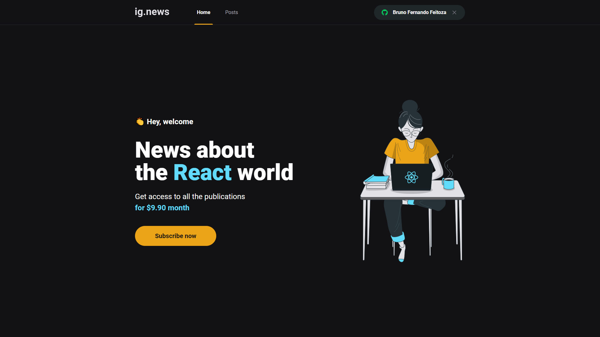
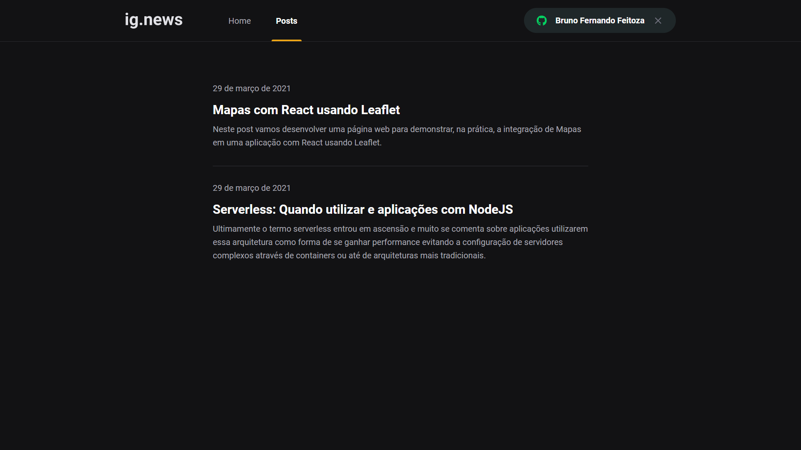
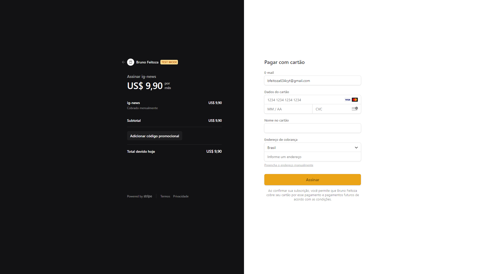
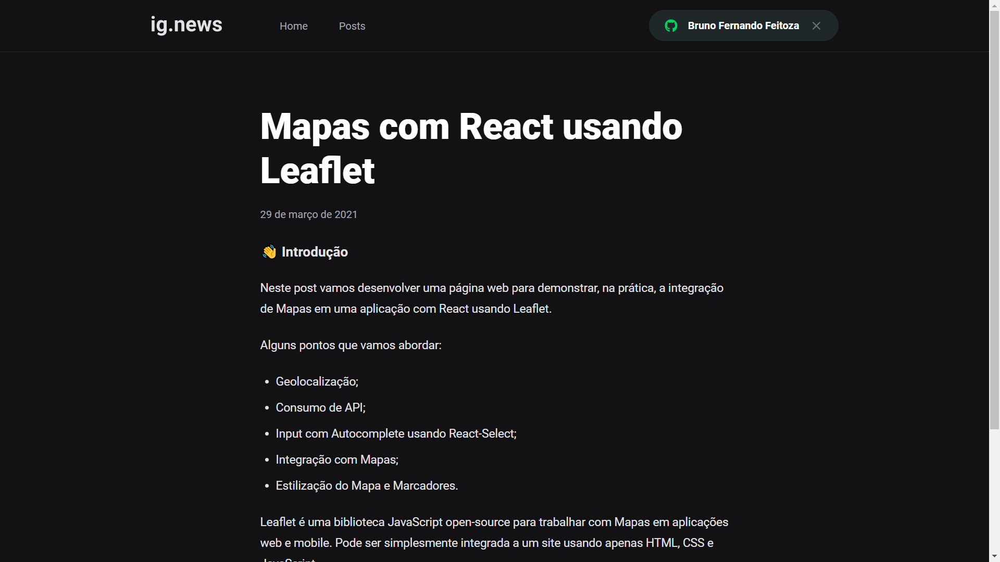

<p align="center">
   
</p>

<div align="center">
    
    <a href="https://www.linkedin.com/in/josewportomarinhojr/" target="_blank" rel="josewportomarinhojr">
      
    </a>
    
  </p>
</div>

<p align="center">
    <a href="README.md">English</a>
    ·
    <a href="README-pt.md">Português</a>
 </p>


<p align="center">
  📰 ig.news is a blog where you can stay on top of the latest news about the React world.
</p>

<p align="center">Project developed during the <strong>Chapter III</strong> of Ignite | <a href="https://rocketseat.com.br/">Rocketseat</a></p>

<hr />

<p align="center">In this project, abord very important concepts from Next.js, like Server Side Rendering, Static Site Generation, API Routes, integration with Stripe, an internet payment infrastructure, webhooks with Stripe, data persistence in FaunaDB, a non-relational database focused on serverless, authentication with GitHub using Next Auth and best practices in css using Sass.
</p>


# :camera: Screenshots
<div align="center">
   
   
   
   
</div>


# :rocket: Technologies
This project was made using the follow technologies:

* [React](https://reactjs.org/)
* [Next.js](https://nextjs.org/)
* [NextAuth.js](https://next-auth.js.org/)
* [TypeScript](https://www.typescriptlang.org/)
* [Sass](https://sass-lang.com/)
* [React Icons](https://react-icons.github.io/react-icons/)
* [FaunaDB](https://fauna.com/)
* [Stripe](https://stripe.com/br)
* [Prismic](https://prismic.io/)
* [Axios](https://github.com/axios/axios)
* [Husky](https://www.npmjs.com/package/husky)
* [Commitlint](https://github.com/conventional-changelog/commitlint)

# :computer: How to run

```bash
# Clone Repository
$ git clone https://github.com/josewmarinho/ig-news.git && cd ig-news

# Install Dependencies
$ yarn

# Fill .env.local file with YOUR environment variables, according to .env.example file.

# Run Aplication
$ yarn dev
```
Go to http://localhost:3000/ to see the application running.


# :closed_book: License

Released in 2021 :closed_book: License

Made by [José Wellington](https://github.com/josewmarinho) 🚀.
This project is under the [MIT license](./LICENSE).

Give a ⭐️ if this project helped you!
